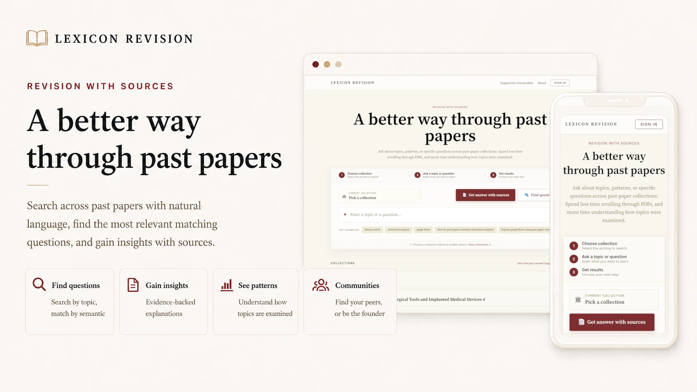
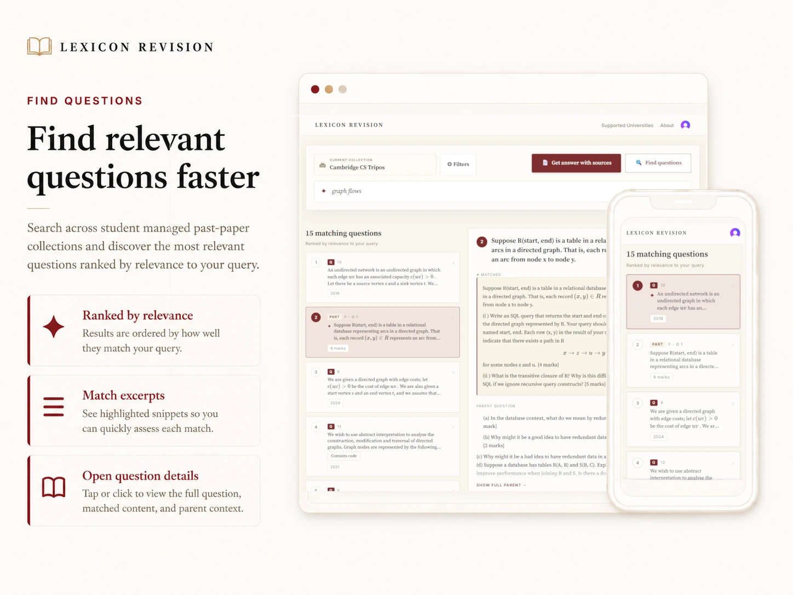
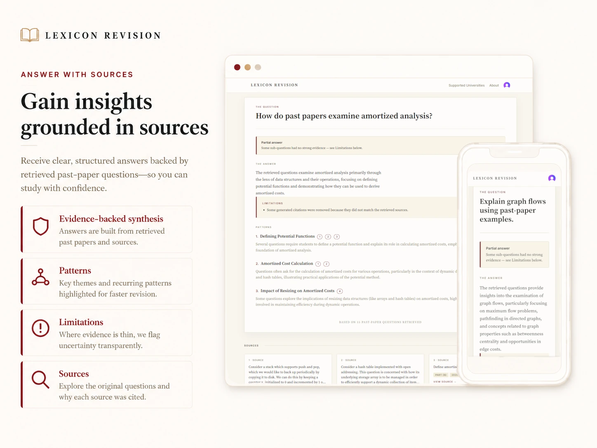

<p align="center">
  <picture>
    
  </picture>
</p>

<h1 align="center">Lexicon Revision</h1>

<p align="center"><strong>Specialized RAG infrastructure for university exam revision.</strong></p>

<p align="center">
  Lexicon Revision uses offline ingest scripts to convert past-paper PDFs into
  indexed retrieval collections. The runtime serves natural-language search and
  citation-grounded study-guide generation over collection-authorized corpora.
</p>

<p align="center">
  <a href="https://lexiconrevision.uk">lexiconrevision.uk</a>
</p>

<br />

---

## Why this project exists

Past papers are one of the highest-signal study resources at a university, but
they are usually locked inside PDFs, inconsistent formatting, and manual search.
Lexicon Revision builds the backend needed to treat curated paper sets as
structured retrieval corpora.

Students can search for a topic, filter by paper metadata, inspect the original
questions, and generate a study guide that links each synthesized point back to
retrieved source chunks. Behind that workflow is a full document-to-answer
pipeline for turning academic PDFs into structured, access-controlled retrieval
collections.

- **Retrieval over real academic documents**: the ingest pipeline stores
  flattened search text plus structured render blocks and media refs for
  supported math, code, table, and image content.
- **Grounded study generation**: generated study guides summarize recurring
  patterns and limitations, with citations validated against the actual
  retrieved context.
- **Deployable system design**: the repo includes a Fly-ready backend, Docker
  runtime, readiness checks, rate limiting, auth integration, object storage,
  and a static Vite frontend intended for Cloudflare Pages deployment.

---

## System at a glance

```text
Past-paper PDFs
      |
      v
  MinerU OCR
      |
      v
  Parser-specific chunking
      |
      +--> question / sub-question hierarchy
      +--> plain-text search payload
      +--> structured render blocks
      +--> media refs for figures
      |
      v
  Postgres + pgvector
      |
      +--> schema-driven metadata filters
      +--> vector search with 3x over-fetch
      +--> optional reranking
      +--> per-collection abstention thresholds
      |
      v
  Study pipeline
      |
      +--> LLM query planning
      +--> planned retrieval
      +--> parent/child deduplication
      +--> context packing under token budget
      +--> structured JSON generation
      +--> citation validation and fallback responses
```

### Service architecture

Ingestion is decomposed into a queue-backed worker service on AWS,
provisioned with Terraform (`infra/terraform/`):

```text
  API service (FastAPI, Fly.io)
      |  POST /admin/ingest (operator-only) enqueues per-paper jobs
      v
  AWS SQS queue --redrive(3)--> DLQ --> CloudWatch alarm
      |
      v
  Ingestion worker (ECS Fargate, scales 0<->1 on queue depth)
      |  fetch PDF from R2 -> MinerU (CPU) -> chunk -> embed -> index
      v
  Neon Postgres + Cloudflare R2 (shared stores)
```

Jobs are idempotent per paper: re-delivery converges through upserts, failed
or malformed messages are never deleted by the worker and land in the
dead-letter queue after three strikes, and the worker scales to zero when the
queue is empty. Design notes and trade-offs live in
[`infra/terraform/README.md`](infra/terraform/README.md).

The study pipeline has explicit fallback paths. Planner errors fall back to the
raw query. Empty or filtered retrieval returns an insufficient-evidence state.
When retrieval succeeds but context building, generation, schema repair, or
citation validation fails, the response can still return retrieved source
cards. Schema validation failures trigger the configured number of repair
attempts, currently one by default.

---

## Engineering highlights

### Purpose-built RAG orchestration

The study pipeline is built around the shape of exam papers and the failure
modes that show up in LLM-backed retrieval products: noisy OCR, hierarchical
questions, hard metadata filters, limited context windows, malformed model
output, and citations that must be checked before they reach the user.

- **Query planning** rewrites a student's natural-language request for semantic
  search while keeping explicit metadata constraints as hard filters.
- **Hybrid retrieval flow** embeds the planned query, searches pgvector with
  cosine similarity, over-fetches candidates, reranks them, and applies
  collection-specific score thresholds when calibrated.
- **Parent-child deduplication** handles the question/sub-question hierarchy so
  the same exam content does not dominate the packed context.
- **Token-budgeted context packing** truncates or omits chunks deterministically
  before generation.
- **Structured generation** asks the model for a schema-validated answer with
  overview, patterns, cited sources, and limitations.
- **Citation validation** checks generated chunk IDs against the packed
  retrieved context, including normalization for model-invented subpart suffixes.
  It does not verify every factual claim.
- **Source-card fallback** returns retrieved sources when retrieval succeeds but
  generation, schema repair, or citation validation fails.

### Content model built for exams

Exam questions are not plain text. The ingestion path preserves a dual payload
for each chunk:

- **Search text**: flattened, normalized content optimized for embeddings and
  ranking.
- **Render blocks**: structured display content for math, code, tables, figures,
  lists, and paragraphs.

That split lets the backend index clean semantic text while the frontend renders
questions in a form close to the original paper. Media refs are stored as object
keys and materialized as presigned URLs on read, so parser-local file paths do
not leak into runtime responses.

### Schema-driven collections

Collections are both the retrieval boundary and the access boundary. Public
collections are anonymous-safe, while private collections require a resolved
community membership from verified identity data. Each collection carries its
own metadata schema, so filters are validated against the corpus instead of
being hardcoded to Cambridge-specific fields.

For Cambridge, a verified `@cam.ac.uk` identity maps to the relevant community.
The access model distinguishes accessible, sign-in-required, and wrong-university
states while keeping backend authorization authoritative on `/search`, `/study`,
and chunk-detail reads.

### Calibrated retrieval thresholds

Search supports optional per-collection thresholds for vector and reranked
scores. A calibration script can suggest rerank thresholds from labeled positive
and negative cases by looking for a clean gap between the weakest true positive
and strongest false positive. New collections start without abstention
thresholds until they have evidence.

### Production-oriented backend seams

Runtime dependencies are built behind provider/config interfaces for retrieval,
planning, generation, auth, rate limiting, and object storage. Production
startup validation rejects local providers/storage, dev routes, missing Clerk
settings, and missing Redis rate-limit configuration; rate-limit backend
failures return 503.

---

## Product walkthrough

The live app is available at
[lexiconrevision.uk](https://lexiconrevision.uk).

<details open>
<summary><strong>Search past-paper questions by topic</strong></summary>

Natural-language search over exam questions, with metadata filters and rich
rendering for math, code, tables, and figures.

<p align="center">
  
</p>

</details>

<details open>
<summary><strong>Generate grounded study guides</strong></summary>

Study answers synthesize patterns across retrieved questions and link each claim
back to cited source chunks.

<p align="center">
  
</p>

</details>

---

## Stack

| Layer | Technology |
|-------|------------|
| Backend | Python 3.12, FastAPI 0.135, SQLAlchemy Core 2.0, async services |
| Retrieval | PostgreSQL 16, pgvector cosine search, optional reranking |
| Production AI | Voyage embeddings/reranking, OpenAI-compatible planning and generation |
| Local AI | sentence-transformers embeddings, Ollama planning/generation defaults |
| Study pipeline | LLM query planning, schema-validated JSON output, citation ID validation |
| Ingestion | MinerU OCR, parser-routed chunking, storage-backed media artifacts |
| Ingestion service | AWS SQS + ECS Fargate worker (scale-to-zero), Terraform-provisioned, GitHub OIDC image deploys |
| Auth/access | Clerk in production, stub-header identity in development |
| Runtime | Valkey/Redis-compatible rate limiting, readiness checks, usage logging |
| Storage | S3-compatible object storage, local object storage for development |
| Frontend | React 19.2, TypeScript ~6.0, Vite 8, Tailwind 3.4 |
| Deploy | Fly.io backend, Cloudflare Pages frontend, AWS ECS Fargate ingestion worker |

---

## Getting started

### Prerequisites

- Docker and Docker Compose
- Python 3.12+
- Node.js >=20.19
- pnpm 10+

### Run locally

```bash
# Start Postgres/pgvector and Valkey
docker compose up postgres redis -d

# Load local development defaults
cp .env.example .env
set -a
source .env
set +a

# Install and run the backend
python -m pip install -r requirements.txt -r requirements-local.txt -r requirements-dev.txt
alembic upgrade head
uvicorn src.main:app --reload --host 0.0.0.0 --port 8000

# Install frontend dependencies and start the dev server
cd frontend
pnpm install
VITE_API_BASE_URL=http://127.0.0.1:8000 pnpm dev
```

The frontend dev server runs with stub-header auth by default, so any email
works locally without Clerk setup.

---

## Contributing

Contributions are welcome, especially around new university parsers,
collection metadata schemas, retrieval evaluation cases, and production
hardening.

1. Fork the repository.
2. Create a feature branch: `git checkout -b feature/your-feature`.
3. Open a pull request.

For bugs, feature requests, or questions, open an issue:
[github.com/JinBa1/lexicon-revision/issues](https://github.com/JinBa1/lexicon-revision/issues).

---

## License

This project is licensed under the [Apache License 2.0](./LICENSE).

Apache-2.0 keeps the project open and commercially usable while preserving
copyright, license, patent, and attribution obligations for downstream users.
