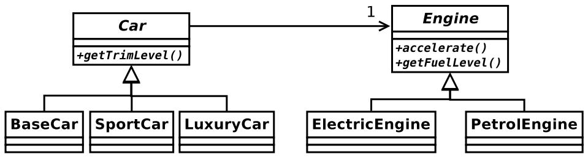

# 4 Object-Oriented Programming (RKH)

A car manufacturer uses Java software to track current vehicles being built. The UML diagram below shows an excerpt of the current software structure. You should assume the presence of other appropriate fields and methods.

(a) Each car can be built to one of three trim levels: base, luxury or sport. They can also be configured with an electric or petrol engine. At various points in the manufacturing process the customer can choose to change the trim level.

(i ) Explain in detail why the current structure does not support this.

[3 marks]

(ii ) Show how to refactor the structure to allow trim-level change using a standard design pattern, which you should identify. Explain how it addresses the problems you identified in Part (a)(i) and show how you would implement getTrimLevel() in Car. [5 marks]

(iii ) Compare and contrast your solution to Part (a)(ii ) with an alternative approach that stores the current trim level as a private String field within Car. [2 marks]

(b) The manufacturer decides to offer a vehicle with a hybrid engine that is both an electric engine and a petrol engine.

(i) Some languages support multiple inheritance of type, method implementation and state. Identify the problems each introduces and discuss the extent to which Java supports them. [5 marks]

(ii ) Refactor the software structure to achieve the effect of multiple inheritance of type and method implementation for HybridEngine in Java without using default methods. Show how your solution would support an accelerate() method for HybridEngine that uses the electric engine if the battery level is above some threshold or the petrol engine otherwise.

[5 marks]