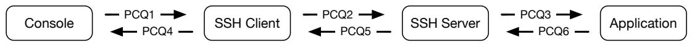

# 7 Concurrent and Distributed Systems (RNW)

UNIX pipes and SSH connections can be modeled as single-recipient producerconsumer queues (PCQs). Consider the following processes linked by PCQs forwarding console input to the application, and output back to the console:



Each queue has a fixed limit of N (≥ 1) bytes. A PCQ is readable if there is a non-zero number of bytes in its buffer. A PCQ is writable if there are fewer than N bytes of data in its buffer. Four (simplified) I/O system calls are used:

$\mathbf{b} =$ readbyte(pcq) Read one byte of data from pcq; blocks if pcq is empty.   
writebyte(pcq, b) Writes one byte of data to pcq; blocks if pcq is full.   
waitread(pcq1, ..) Block until at least one argument is readable.   
pollread(pcq) Returns true if pcq is readable.

With crypto omitted, SSH client and server workloops are implemented as:

```javascript
1: while (1) {
2: waitread(input1, input2); // Wait for input on either PCQ
3: if (pollread(input1)) {
4: b = readbyte(input1);
5: writebyte(output2, b);
6: }
7: if (pollread(input2)) {
8: b = readbyte(input2);
9: writebyte(output1, b);
10: } 
```

(a) What is the maximum amount of data buffered across all PCQs? [2 marks]   
(b) Applications often echo user keypresses, printing input characters as they process them. If the user hits the ‘A’ key, at most how many times will PCQ semaphores be signaled before the character is printed on the console? [2 marks]   
(c) The system operator sets N to 1 and pastes a long list of commands into the console. Part way through, the SSH Server and Application processes hang. Succinctly explain what happened, describing PCQ3 and PCQ6 starting states, initial line number for the SSH Server, and event sequence. [6 marks]   
(d ) Explain why, on a busy system, key press echoes might be delayed when a high-priority user interacts with a low-priority application. Propose a solution, describing how each of the above system calls should be changed, and any additional state required. Describe limitations that might apply. [10 marks]