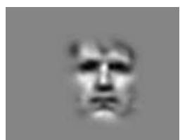
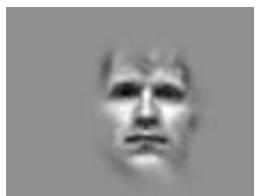
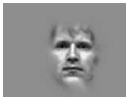
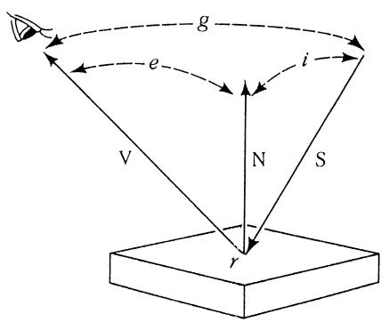

# 4 Computer Vision (jgd1000)

(a) Explain why such a tiny number of 2D Gabor wavelets as shown in this sequence are so efficient at representing faces, and why such wavelet-based encodings deliver good performance in "appearance-based" algorithms for face recognition. What role do such encodings have in representing different facial expressions? What sort of neural evidence is there for such encodings in human vision?

  
16

  
52

  
116

  
216   
Number of Wavelets

[6 marks]

(b) Explain the "receptive field" concept as used both in CNNs (convolutional neural networks) and in visual neuroscience, and explain the role of trainable connections. Why is the concept of convolution relevant? Roughly how many layers are in the 'FaceNet' CNN, and how many connection parameters must be trained? By comparison, in the visual cortex of the brain, typically how many synapses are there per neurone, and what is the total length of "wiring" (neurite connections) per cubic-millimeter? Can connection updates be a basis for computer vision? [6 marks]   
(c) In relation to the image formation diagram shown below, explain: (i) the concept of a reflectance map; (ii) what is a specular surface; (iii) what is a Lambertian surface; and (iv) what is surface albedo. Give the defining relationships for the amount of light from a point source that is scattered in different directions by such illuminated surfaces, and describe the inferences that a vision system must make with them. [8 marks]

