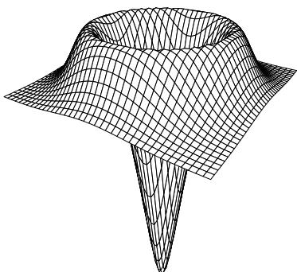
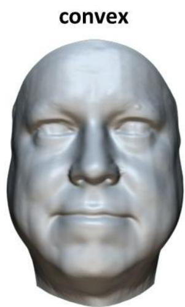
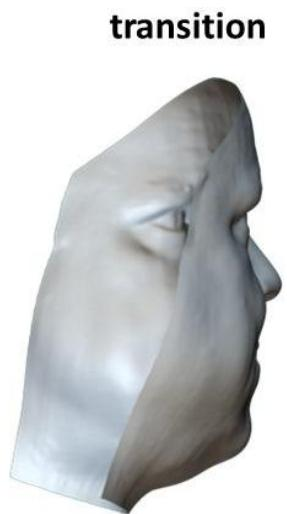
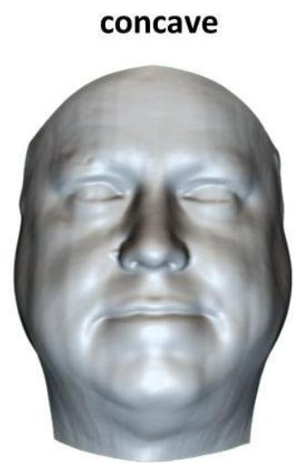

# 5 Computer Vision (jgd1000)

(a) In early stages of machine vision systems, the isotropic operator shown on the right is often applied to an image $I ( x , y )$ in the following way: $[ \nabla ^ { 2 } G _ { \sigma } ( x , y ) ] * I ( x , y )$ .

What is the purpose of this operation? Which class of neurones in the retina does it mimic?

How would the results differ if instead this operation: $G _ { \sigma } ( x , y ) * \nabla ^ { 2 } I ( x , y )$ were performed; or alternatively if this operation: $\nabla ^ { 2 } \left[ G _ { \sigma } ( x , y ) * I ( x , y ) \right]$ were performed?

  
[6 marks]

(b) Computer vision colour space is usually three-dimensional, just because human vision is tri-chromatic and therefore cameras are designed with three colour planes. But suppose we added a fourth colour plane, say yellow (Y), to the standard red, green, and blue (RGB) bands. Considering that these are linearly independent but not orthogonal vectors, what would be the added capability of RGBY space? What tests would reveal it? Present a version of the Retinex algorithm for RGBY space, explaining the purpose of each step in the algorithm.

[8 marks]

(c) Visual inference of surface shape depends on assumptions and prior knowledge, such as “faces are mostly convex”. Explain the “rotating hollow mask illusion”. Why does a face mask (as pictured below) appear to reverse its direction of rotation, once it is seen from the inside instead of the outside? What is the role of Bayesian inference when interpreting a face-like surface that is actually concave in presentation instead of convex? Should visual illusions like this be considered “features” or “bugs”, and should one try to design them in to a computer vision system? [6 marks]

