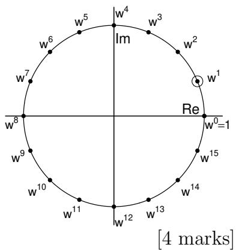

# 9 Information Theory (jgd1000)

(a) If I pick a number n that can be any integer from 1 to $\infty$ whose probability distribution of being selected is $\displaystyle { \left( { \frac { 1 } { 2 } } \right) ^ { n } }$ , and you ask a series of $\mathrm { \dot { y } e s } / \mathrm { n o } ^ { \prime }$ questions which I will answer truthfully, how many such $\mathrm { \dot { y } e s } / \mathrm { n o } ^ { \prime }$ questions should you expect to ask before discovering which number I have picked? Justify your answer by invoking a known series limit. What sequence of questions would be the most efficient to ask, and why? [4 marks]   
(b) An inner product space containing complex functions $f ( x )$ and $g ( x )$ is spanned by a set of orthonormal basis functions $\{ e _ { i } \}$ . Complex coefficients $\left\{ \alpha _ { i } \right\}$ and $\{ \beta _ { i } \}$ therefore exist such that $f ( x ) = \sum _ { i } \alpha _ { i } e _ { i } ( x )$ and $g ( x ) = \sum _ { i } \beta _ { i } e _ { i } ( \stackrel { . } { x } )$ .

Show that the inner product $\langle f , g \rangle = \sum _ { i } \alpha _ { i } { \overline { { \beta _ { i } } } }$ . [4 marks]

(c) Consider a data sequence $f [ n ] \ ( n = 0 , 1 , . . . , 1 5 )$ having Fourier coefficients $F [ k ] \ ( k = 0 , 1 , \ldots , 1 5 )$ . Using the $1 6 ^ { \mathrm { t h } }$ roots of unity labelled around the unit circle as powers of $\mathrm { w } ^ { 1 }$ , the primitive $1 6 ^ { \mathrm { t h } }$ root of unity, construct a sequence of the $\mathrm { w } ^ { i }$ that could be used to compute $F [ 3 ]$ when an inner product is computed between your sequence of $\mathrm { w } ^ { i }$ and the data sequence $f [ n ]$ .

(d) Explain how vector quantisation exploits sparseness to construct very efficient codes. Use the example of encoding a natural language lexicon with a 15 bit coding budget. Contrast the strategy of using codewords for single letters versus using codewords as pointers to a sparse index of combinations of letters.

[4 marks]

(e) A continuous signal $f ( t )$ has Fourier transform $F ( \omega )$ . Explain why computing derivatives of $f ( t )$ such as $f ^ { \prime } ( t )$ or $f ^ { \prime \prime } ( t )$ amounts simply to high-pass filtering. For the $n ^ { \mathrm { t h } }$ derivative $f ^ { ( n ) } ( t )$ , what exactly is this filtering operation when expressed in terms of $F ( \omega ) ?$ Show how this operation could be used to define derivatives of non-integer order (for example the $1 . 5 ^ { \mathrm { t h } }$ derivative). [4 marks]